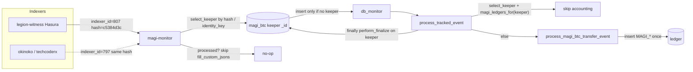
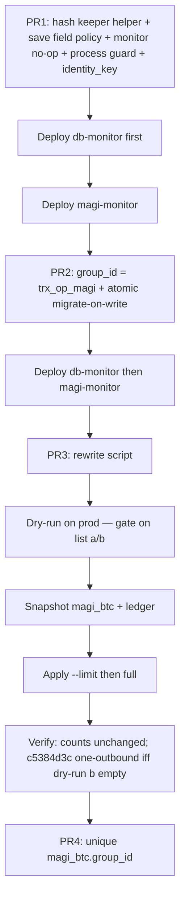

# Magi `group_id`: Drop `indexer_id` (Indexer-Agnostic Identity)

| Field | Value |
|---|---|
| **Author** | v4vapp-backend-v2 maintainers |
| **Date** | 2026-09-12 |
| **Status** | Draft |
| **Repo** | v4vapp-backend-v2 |
| **Primary code** | `src/v4vapp_backend_v2/magi/magi_classes.py` (`MagiBTCTransferEvent.group_id`) |

---

## Overview

Magi Hasura indexers assign **local monotonic `indexer_id`s**. After a from-0 rescan on `legion-witness`, legion ids diverged from okinoko/techcoderx (same Hive tx hashes, different ids; legion tip 808 vs okinoko 803; offset +3 then +5). v4vapp `magi-monitor` talks only to legion (`MAGI_ENDPOINTS[0]` in `src/v4vapp_backend_v2/magi/magi_balances.py`).

Today `MagiBTCTransferEvent.group_id` embeds that local id:

```python
# magi_classes.py MagiBTCTransferEvent.group_id
return f"{self.indexer_id}_{self.trx_id}_magi"
```

`save()` upserts on `{"group_id": self.group_id}`. A rescan, indexer failover, or dual-indexer feed therefore upserts a **second** Mongo document for the same Hive/VSC transfer, and `db_monitor` will re-run `process_magi_btc_transfer_event` → **double `MAGI_OUTBOUND` / `FEE_INCOME`**. Production just closed Hive tx `c5384d3cd49b971967ba5259096fe330c7f42139` (`k2JDVOv3nV`) as `802_c5384d3cd49b971967ba5259096fe330c7f42139_magi` with `MAGI_OUTBOUND`. History rewrite must not re-run outbound accounting.

This design:

1. Changes `group_id` going forward to `{trx_id}_{op_in_trx}_magi` (indexer-agnostic).
2. Introduces one **per-op** hash-based keeper helper used by `save()`, `load_tracked_object` (string **and** instance), `process_tracked_event`, and magi-monitor. Incoming `group_id_p` is **not** the lookup key for “already processed?” Sibling ops in one Hive tx stay distinct.
3. Makes Magi `save()` a **field-policy update**, not a blind `model_dump` `$set`. Existing docs never lose `indexer_id` (resume cursor) or `process_time`.
4. Provides a small, dry-run-first rewrite script for historical `magi_btc.group_id` and MAGI_* ledger ids — **without duplicating books, without touching `indexer_id`, without moving the Hasura resume cursor**.

---

## Background & Motivation

### Current identity

| Field | Source | Stability across indexers |
|---|---|---|
| `indexer_id` | Hasura local monotonic counter | **Unstable** (legion 808 vs okinoko 803) |
| `indexer_tx_hash` | Hive txid, optionally with `-N` suffix for multi-op txs | **Stable** (same Hive hash) |
| `trx_id` | `indexer_tx_hash` with trailing `-N` stripped (`rsplit("-", 1)`) | **Stable** |
| `op_in_trx` | no suffix → 1, `-0` → 1, `-1` → 2, non-numeric suffix → 1 | **Stable** (derived from hash) |
| `short_id` | `{trx_id[-8:]}_m` | **Already stable** (not unique for two ops in one tx) |
| `group_id` | `{indexer_id}_{trx_id}_magi` | **Unstable — this is the bug** |

Resume cursor `get_last_indexer_id()` (`src/magi_monitor.py`) is a **separate concern**. It reads `max(indexer_id)` from `magi_btc` and feeds the Hasura stream `cursor: {initial_value: {indexer_id: N}}`. Docker compose `magi-monitor` does **not** pass `--from-indexer-id` (default `-1` = resume from last saved). **Do not conflate cursor with `group_id`.** Live `save()` and the rewrite script both leave `indexer_id` on an existing `_id` untouched (first-writer wins).

Pre-existing cursor caveat (not this work): magi-monitor **only persists watched events** (`magi_monitor.py` 163–172: `fill_custom_jsons` iff `is_watched`). `get_last_indexer_id` is therefore max **watched** `indexer_id`. A from-0 indexer rebuild still requires an explicit `--from-indexer-id 0` (or empty collection); default resume-from-max will skip remapped low ids. Hash-stable `group_id` only stops double-posting when those hashes are seen again.

### How the id is consumed today

`group_id` is a `@computed_field`, so `TrackedBaseModel.save()` persists it via `model_dump` and upserts on `group_id_query = {"group_id": self.group_id}`:

```291:348:src/v4vapp_backend_v2/actions/tracked_models.py
    async def save(...) -> UpdateResult:
        ...
        return await mongo_call(
            lambda: InternalConfig.db[self.collection_name].update_one(
                filter=self.group_id_query, update=update, **mongo_kwargs
            ),
            ...
        )
```

That dump `$set`s **every non-None field**, including `indexer_id` and computed `group_id`. Magi-monitor persist is `fill_custom_jsons()` → `update_conv()` → `save()` (`magi_classes.py` 307–313) on a **fresh stream object**, not a loaded doc. A naive “find by hash then `$set` dump on same `_id`” would rewrite `indexer_id=802` → `807` and `group_id=802_…` → `807_…`, desyncing the resume cursor and the already-booked ledger row `802_…_magi_magi_out`.

Ledger MAGI rows suffix the Magi event id:

```python
# process_magi.py magisats_outbound / magisats_inbound / magisats_fee_ledger_entry /
# return_magisats / magisats_funding
group_id=f"{magi_transfer.group_id}_{ledger_type.value}"
```

So a closed outbound looks like:

| Collection | Field | Production value for `c5384d3c…` |
|---|---|---|
| `magi_btc` | `group_id` | `802_c5384d3cd49b971967ba5259096fe330c7f42139_magi` |
| `ledger` | `group_id` (`MAGI_OUTBOUND`) | `802_c5384d3cd49b971967ba5259096fe330c7f42139_magi_magi_out` |
| `ledger` | `group_id` (`FEE_INCOME`) | `802_c5384d3cd49b971967ba5259096fe330c7f42139_magi_fee_inc` |

`tests/data/config/config.yaml` defines unique `ledger.group_id`. Production InternalConfig yaml is **not in this repo** (gitignored `config/*.config.yaml`; compose uses `${DOCKER_COMPOSE_CONFIG:-devdocker.config.yaml}`; ad-hoc scripts mention `production.fromhome.config.yaml`). `LedgerEntry.save()` is `insert_one` unless `upsert=True`. Duplicate inserts raise `LedgerEntryDuplicateException` **only if** the unique index exists in prod. Confirm `collections.ledger.indexes.ledger_id` on the live `--config` file before treating it as a last line of defense. It still cannot stop two MAGI_OUTBOUND rows with **different** prefixes (`802_…_magi_out` vs `807_…_magi_out`).

### Duplicate-guard gap (critical)

`process_tracked_event` (`src/v4vapp_backend_v2/process/process_tracked_events.py` 119–141, 262–266):

1. `LedgerEntry.load(group_id=tracked_op.group_id_p)` — looks up the **unsuffixed incoming** Magi event id. MAGI_OUTBOUND is stored **with** `_magi_out`. **This never matches Magi ledger rows.**
2. `load_tracked_object(tracked_obj=tracked_op.group_id_p)` then `existing_op.process_time` — **today this is the real skip**, but it is a **string** lookup of the *incoming* id. Production docs have `group_id=802_c5384d3c…_magi` and **no** `legacy_group_id`. A rescan computes `group_id_p=807_c5384d3c…_magi` (PR1) or `c5384d3c…_1_magi` (PR2). Neither string hits the 802 doc unless lookup is by **hash / `identity_key`**.
3. Early returns at 121–141 are **before** the `try`/`finally`. `perform_finalize` (sets `process_time` + `save()`) only runs from the `finally` at 262–266, or from the unsuffixed-ledger early path at 127–130. A Magi “already booked” skip that returns at 135–141 will **not** stamp `process_time` on the keeper.

If a second `magi_btc` document is inserted (new `group_id`, `process_time` unset), `db_monitor` will post a second `MAGI_OUTBOUND`. Unique `ledger.group_id` does **not** help: the new ledger id is also different.

Enumerating `{incoming group_id, incoming legacy_group_id_computed}` × ledger types also misses: `legacy_group_id_computed` uses the **current** indexer id (807), not 802.

### Change-stream re-entry

`db_monitor` watches `magi_btc` (`db_monitor_pipelines()["magi_btc"]` matches non-delete with `fullDocument.indexer_id != None`). `ignore_changes` is a **subset** test (`db_monitor.py` 252): the update is ignored only when **every** `updatedFields` key is in `IGNORED_UPDATE_FIELDS`. Today that list includes `process_time`, `conv`, `fee_conv`, `replies` — **not** `group_id`, `custom_jsons`, `memo`, or `indexer_id`.

`fill_custom_jsons` always writes `custom_jsons` (and usually `memo` / `conv`). Adding `group_id` / `legacy_group_id` to the ignore list only hides **pure** identity rewrites. A dual-find in-place save from magi-monitor that `$set`s `custom_jsons` **re-enters** `process_op` → `process_tracked_event`. That is the rescan double-post trigger, not the rewrite script. Inserts still process (no `updatedFields`) — correct.

`IGNORED_UPDATE_FIELDS` is **process-wide** (`db_monitor.py` 427). Adding `group_id` also ignores ledger-only `$set group_id` updates. The `ledger` pipeline has no `updatedFields` filter (`simple_pipelines.py` 300–307), so an un-ignored ledger rename would `ingest_ledger_entry`. `FEE_INCOME` stages exist in multiple Overwatch flows and match **by `ledger_type` only** (`process_overwatch.py` 174–175). A rewritten Magi `FEE_INCOME` with a *new* `group_id` would not dedupe (`process_overwatch.py` 848–860) and could attach to an unrelated in-flight flow. The global ignore-list change is therefore what keeps ledger renames out of Overwatch — it is not magi_btc-only.

### Production incident (worked example)

Hive tx `c5384d3cd49b971967ba5259096fe330c7f42139` / admin short `k2JDVOv3nV` closed as:

- Magi event: `802_c5384d3cd49b971967ba5259096fe330c7f42139_magi`
- Ledger: `MAGI_OUTBOUND` (and fee if any)

A from-0 rescan on legion that re-emits the same hash at a new `indexer_id` (e.g. 807) would currently save `807_c5384d3c…_magi` as a **new** document and book a second outbound. After this work, hash lookup finds the 802 keeper, magi-monitor no-ops, `process_tracked_event` sees MAGI_OUTBOUND on the keeper’s stored id, and `indexer_id` stays 802.

---

## Goals & Non-Goals

### Goals

- Same Hive/VSC transfer from **any** Magi indexer upserts the **same** `magi_btc` Mongo document.
- `group_id` is indexer-agnostic and still distinguishable from Hive (`_real`) and Lightning (`r_hash` / `payment_hash`).
- Multi-op Hive txs remain distinct (`op_in_trx` in the id).
- Historical rewrite of `magi_btc.group_id` and dependent MAGI_* ledger `group_id`s, dry-run first.
- **Zero new MAGI_OUTBOUND / MAGI_INBOUND / FEE_INCOME / MAGI_CHANGE / FUNDING rows** from this work. Already-duplicated books are **not** repaired here.
- Resume cursor (`get_last_indexer_id` / `--from-indexer-id`) unchanged: **never overwrite `indexer_id` on an existing `_id`.**
- `load_tracked_object` still resolves Magi events, including historical parent_ids already on-chain or in LND custom records, **and** instance-branch loads of a rescan event with a different `indexer_id`.
- Tests cover the actual double-post sequence (fresh stream object, different `indexer_id`, zero new ledger, unchanged `indexer_id` / `process_time`).
- PR2: `wait_for_magi_btc_event` / `find_magi_btc` find events stored as `txid-0` when given Hive `custom_json.trx_id` (unsuffixed).

### Non-Goals

- Switching Magi endpoints / multi-indexer streaming.
- Rewriting Lightning invoice `group_id` (`r_hash`), payment `group_id` (`payment_hash`), Hive `hive_ops.group_id`, **`hive_ops.json.parent_id` / `json.payload.parent_id`** (v1: helper lookups are enough), Hasura, or `magi_btc.indexer_id`.
- Deleting merge-loser `magi_btc` docs (quarantine with `__dup_` prefixes; keep the row for forensics).
- Reprocessing / reversing / merging amounts of existing Magi ledger entries (including already-duplicated MAGI_OUTBOUND pairs).
- Changing `short_id` (`{trx_id[-8:]}_m`).
- Broad overwatch Redis key migration (flows are keyed by **invoice** `trigger_group_id` for outbound Magi; Magi stages match by `op_type` / `ledger_type`).
- Making `process_tracked_event`’s unsuffixed `LedgerEntry.load(group_id_p)` magically match MAGI_OUTBOUND.

---

## Key Decisions

1. **New format is `{trx_id}_{op_in_trx}_magi`.** Indexer-agnostic, keeps multi-op distinction that the current id accidentally got from `indexer_id`, and stays in the `_magi` namespace `load_tracked_object` already uses. Hive remains `{block}_{trx}_{op}_{realm}`. (PR2)

2. **Processing and upsert identity is `(trx_id, op_in_trx)`, not incoming `group_id_p`.** Persist `identity_key = f"{trx_id}_{op_in_trx}"`. Hash aliases are **per op**: op 1 → `{txid, txid-0}` only; op ≥ 2 → `{txid-(op-1)}` only; never add stripped `trx` for op ≠ 1. Do **not** expand an old-format `group_id` string into hash aliases (no `op_in_trx` in that string — derive op only from `indexer_tx_hash`). One helper (`find_magi_docs` + `select_keeper`) is called from `save()`, both `load_tracked_object` branches, `process_tracked_event`, and magi-monitor. (PR1)

3. **Keep `legacy_group_id` on `magi_btc` permanently.** On-chain VSC `parent_id` and LND `v4vapp_group_id` already store the old Magi id for inbound follow-on (`process_transfer.send_lightning_to_pay_req(group_id=tracked_op.group_id_p)`). Those cannot be rewritten. Value is always copied from the **stored** `group_id` at first dual-find, never from `f"{current_indexer_id}_{trx_id}_magi"`. (PR1 populate; PR2/3 keep)

4. **Rewrite in place (`$set` on the same `_id`).** Do not delete+insert. Preserve `process_time`, `replies`, `conv`, `fee_conv`, `indexer_id`. Do not insert ledger rows. Only rename MAGI_* `ledger.group_id`. Merge-loser `magi_btc` docs are **quarantined, never deleted**: prefix `group_id` **and** `legacy_group_id` (and `identity_key`) with `__dup_`; keep the row for forensics. (PR3)

5. **PR1 `save()` must not migrate `group_id`.** Hash dual-find, preserve stored `group_id` + `indexer_id`, set `legacy_group_id` from stored `group_id` if absent, set `identity_key` if absent. Magi-monitor **no-ops** (skip `fill_custom_jsons`) when the keeper already has `process_time` or a MAGI_* ledger. **PR2 migrate-on-write is the default** once PR1 is live: one atomic `$set` `{group_id: new, legacy_group_id: stored}`. History script still rewrites untouched rows. Do not combine PR1+PR2 unless that matrix is in the same diff and reviewed as such. (PR1 then PR2)

6. **Do not overwrite `indexer_id` or the Hasura cursor.** `get_last_indexer_id()` continues to `sort=[("indexer_id", -1)]`. First-writer wins on an existing `_id`. Script never writes `indexer_id`. Stream `save()` never writes `indexer_id` on a keeper. (PR1+)

7. **Magi ledger guard is keyed off the keeper, not the incoming event and not the whole Hive tx.** Skip iff keeper `process_time` is set **or** a MAGI_* ledger exists for that keeper’s **stored** `group_id` / `legacy_group_id` × types. Do **not** regex on `trx_id` (old MAGI_* ids have no op; op 1’s `802_txid_magi_magi_out` would skip op 2). Incoming `legacy_group_id_computed` is **not** sufficient. Place the skip **inside** the `try` so `finally` → `perform_finalize` can stamp `process_time` on the **keeper**. `short_id` is not unique for multi-op txs — do not use it as a guard. (PR1)

8. **`IGNORED_UPDATE_FIELDS` change is global** (`group_id`, `legacy_group_id`, `identity_key`). That is what keeps script ledger-renames out of Overwatch. Do not rely on Overwatch `(event_type, group_id)` dedupe — rewritten ids are new. Magi-monitor no-op on processed keepers is the primary defense against `custom_jsons` re-entry; the ignore list is not enough by itself because `ignore_changes` is a subset test. (PR1)

9. **Atomic uniqueness: backfill every `magi_btc.identity_key`, then a non-sparse unique index.** Mongo unique indexes treat missing as `null`; more than one missing field fails the build. `IndexConfig` (`config/setup.py` 329–331) has only `index_key` + `unique`; `DBConn.setup_collections_indexes` does not pass `sparse` (`db_pymongo.py` 386–389). Do **not** add sparse (would still allow two inserts that omit the field). PR1 ops: compute key from `indexer_tx_hash` on **all** rows → quarantine duplicate computed keys → `$set` `identity_key` (and `legacy_group_id` from stored `group_id`) on every remaining row → **then** create unique `identity_key`. Catch `DuplicateKeyError` and fall back to keeper update. Unique `magi_btc.group_id` (PR4) is after history rewrite. (PR1 / PR4)

10. **Deploy db-monitor (PR1 guard) before or with magi-monitor; never magi-monitor-PR2 ahead of db-monitor-PR1.** Do not combine PRs unless the save-field matrix is reviewed as one diff. (Rollout)

### Resolved questions (user, 2026-09-12)

11. **v1 does not rewrite `hive_ops.json.parent_id`.** Helper lookups by hash / `legacy_group_id` are enough. Hive-ops JSON stays as-is. (non-goal)

12. **Merge-loser `magi_btc` docs: quarantine, don’t delete.** Prefix `group_id` **and** `legacy_group_id` with `__dup_`; keep the row for forensics. (PR3; also identity-backfill in PR1)

13. **`wait_for_magi_btc_event` / `find_magi_btc` reuse per-op hash aliases in PR2 (in-scope, not optional).** Hive `custom_json.trx_id` is unsuffixed → query `{txid, txid-0}` (op 1 only). Do **not** search `txid-1`.

14. **PR2 migrate-on-write after PR1 is live; default on once PR2 ships.** Atomic `$set` `{group_id: new, legacy_group_id: stored}`. Script still rewrites untouched rows.

---

## Proposed Design

### Target `group_id` (PR2)

```python
@computed_field
def group_id(self) -> str:
    """Indexer-agnostic Magi identity: {trx_id}_{op_in_trx}_magi.

    Not {indexer_id}_{trx_id}_magi — indexer_id is a local Hasura cursor, not identity.
    """
    return f"{self.trx_id}_{self.op_in_trx}_magi"
```

`trx_id` and `op_in_trx` already exist on `MagiBTCTransferEvent` (`magi_classes.py` 254–272, 367–377). PR2 updates this docstring (today it still says `indexer_id_trx_id_magi` while the comment above mentions `op_in_trx`).

Also persist (PR1):

```python
legacy_group_id: str | None = None  # first stored group_id, copied from DB, never from current indexer
identity_key: str | None = None     # f"{trx_id}_{op_in_trx}" — unique constraint
```

`short_id` stays `{trx_id[-8:]}_m`.

`get_tracked_any_type` still uses `if indexer_tx_hash and indexer_id:` (`tracked_any.py` 90–93). `indexer_id=0` is falsy — pre-existing, out of scope.

### Exact before / after examples

#### 1. Production closed outbound (no `-N` suffix)

Hive tx `c5384d3cd49b971967ba5259096fe330c7f42139`, legion `indexer_id=802`, `indexer_tx_hash` unsuffixed, `op_in_trx=1`.

| | Before | After |
|---|---|---|
| `magi_btc.group_id` | `802_c5384d3cd49b971967ba5259096fe330c7f42139_magi` | `c5384d3cd49b971967ba5259096fe330c7f42139_1_magi` |
| `magi_btc.legacy_group_id` | (absent) | `802_c5384d3cd49b971967ba5259096fe330c7f42139_magi` |
| `magi_btc.identity_key` | (absent) | `c5384d3cd49b971967ba5259096fe330c7f42139_1` |
| `magi_btc.indexer_id` | `802` | `802` (**unchanged**, even if a later stream event is 807) |
| `magi_btc.short_id` | `c7f42139_m` | `c7f42139_m` |
| `ledger` MAGI_OUTBOUND | `802_c5384d3cd49b971967ba5259096fe330c7f42139_magi_magi_out` | `c5384d3cd49b971967ba5259096fe330c7f42139_1_magi_magi_out` |
| `ledger` FEE_INCOME | `802_c5384d3cd49b971967ba5259096fe330c7f42139_magi_fee_inc` | `c5384d3cd49b971967ba5259096fe330c7f42139_1_magi_fee_inc` |

If okinoko had indexed the same hash as id 797, **both** monitors upsert the same keeper. Stream id 807 does **not** become `group_id` or `indexer_id` on that doc.

#### 2. Multi-op Hive tx (`-1` suffix)

`indexer_tx_hash = c5384d3cd49b971967ba5259096fe330c7f42139-1`, `indexer_id=803`.

| | Before | After |
|---|---|---|
| `trx_id` | `c5384d3cd49b971967ba5259096fe330c7f42139` | same |
| `op_in_trx` | `2` | same |
| `identity_key` | — | `c5384d3c…_2` |
| `group_id` | `803_c5384d3cd49b971967ba5259096fe330c7f42139_magi` | `c5384d3cd49b971967ba5259096fe330c7f42139_2_magi` |

**Current format drops `op_in_trx` from `group_id`.** Two ops in one tx are only distinct because `indexer_id` differs. Derive `op_in_trx` from `indexer_tx_hash`, never by parsing old `group_id`.

#### 3. First-of-many (`-0`) vs missing suffix

| `indexer_tx_hash` | `trx_id` | `op_in_trx` | `identity_key` | New `group_id` |
|---|---|---|---|---|
| `c5384d3c…` (no suffix) | `c5384d3c…` | 1 | `c5384d3c…_1` | `c5384d3c…_1_magi` |
| `c5384d3c…-0` | `c5384d3c…` | 1 | `c5384d3c…_1` | `c5384d3c…_1_magi` |
| `c5384d3c…-1` | `c5384d3c…` | 2 | `c5384d3c…_2` | `c5384d3c…_2_magi` |

No-suffix and `-0` **intentionally share** `identity_key`. They are the same first (or only) op. `select_keeper` must treat them as one document; prefer the row with `process_time` / MAGI_* ledger.

### Collision analysis

| Case | Current `group_id` | New `group_id` / `identity_key` | Verdict |
|---|---|---|---|
| Same Hive tx, two indexers (the production bug) | `802_txid_magi` vs `797_txid_magi` | both `txid_1_magi` / `txid_1` | **Desired merge.** Keeper = processed / MAGI_* / higher stored `indexer_id`. |
| Two ops, same Hive tx (`-0` and `-1`) | distinct via `indexer_id` | `txid_1` vs `txid_2` | Distinct. |
| No suffix vs `-0` | distinct via `indexer_id` | both `txid_1` | Same first op. Merge; keep processed. Unique `indexer_tx_hash` would **conflict** — do not unique the raw hash. Unique `identity_key` is correct. |
| IPFS CID (`bafyrei…`, `bafyrei…-0`, `bafyrei…-1`) | `{id}_{cid}_magi` | `{cid}_{op}_magi` | Fine. `hive_custom_json` already skips non-`^[0-9a-f]{40}$`. |
| Hive `hive_ops.group_id` | `{block}_{trx}_{op}_{realm}` e.g. `…_1_real` | Magi `…_1_magi` | No collision. Magi branch runs first. |
| Lightning invoice / payment | `r_hash` / `payment_hash` | unchanged | Do not rewrite. |
| Already two MAGI_OUTBOUND rows for one hash | two ledger ids | would both map to one new ledger id | **Do not merge books.** Identity rewrite skips those txs (see script playbook). |

`load_tracked_object` substring check (`"_magi" in group_id or "_m" in group_id`) still matches `{trx}_{op}_magi`. Hive hex + `_real` does not contain `_m`.

### Shared keeper helper (PR1 — the actual dual-read)

All Magi identity resolution goes through one module-level helper on `MagiBTCTransferEvent` (used by save, load, process, monitor). Sequential `find_one` over incoming ids is **not** merge-safe.

```python
_OLD_GID = re.compile(r"^(?P<indexer_id>\d+)_(?P<trx_id>.+)_magi$")
_NEW_GID = re.compile(r"^(?P<trx_id>.+)_(?P<op_in_trx>\d+)_magi$")
_MAGI_LEDGER_TYPES = ("magi_out", "magi_in", "fee_inc", "magi_chg", "funding")

def magi_hash_aliases(indexer_tx_hash: str) -> list[str]:
    """Per-op aliases only. Never include stripped trx for op != 1.

    op 1 (no suffix or -0) → {txid, txid-0}
    op ≥ 2 (txid-N)        → {txid-N} only  i.e. {txid-(op-1)}
    """
    trx = indexer_tx_hash.rsplit("-", 1)[0] if "-" in indexer_tx_hash else indexer_tx_hash
    suffix = indexer_tx_hash.rsplit("-", 1)[1] if "-" in indexer_tx_hash else None
    if suffix is None:
        return list({trx, f"{trx}-0"})
    try:
        op = int(suffix) + 1
    except ValueError:
        return [indexer_tx_hash]  # non-numeric hyphen: do not strip
    if op == 1:
        return list({trx, f"{trx}-0"})
    return [f"{trx}-{op - 1}"]

def identity_key_from_hash(indexer_tx_hash: str) -> str:
    event = MagiBTCTransferEvent.model_construct(indexer_tx_hash=indexer_tx_hash)
    return f"{event.trx_id}_{event.op_in_trx}"

def identity_key_for(trx_id: str, op_in_trx: int) -> str:
    return f"{trx_id}_{op_in_trx}"

async def find_magi_docs(*, indexer_tx_hash: str | None = None,
                         group_id: str | None = None,
                         identity_key: str | None = None) -> list[dict]:
    """Candidates for ONE (trx_id, op_in_trx).

    Instance/save/process: pass indexer_tx_hash (and identity_key). Incoming
    group_id_p is ignored here — AND-ing it would miss stored 802_… docs.

    String parent_id load: pass group_id only. Exact {group_id|legacy_group_id}.
    Old-format strings are NOT expanded into hash aliases (no op_in_trx).
    New-format strings may also query identity_key = {trx}_{op}.
    """
    coll = MagiBTCTransferEvent.collection()

    def _not_dup(d: dict) -> bool:
        return not str(d.get("identity_key") or "").startswith("__dup_")

    if indexer_tx_hash:
        aliases = magi_hash_aliases(indexer_tx_hash)
        key = identity_key or identity_key_from_hash(indexer_tx_hash)
        query = {"$or": [
            {"identity_key": key},
            {"identity_key": {"$exists": False}, "indexer_tx_hash": {"$in": aliases}},
        ]}
        docs = await coll.find(query).to_list(length=20)
        return [d for d in docs if _not_dup(d)]

    if group_id:
        or_terms: list[dict] = [{"group_id": group_id}, {"legacy_group_id": group_id}]
        m_new = _NEW_GID.match(group_id)
        if m_new:
            or_terms.append({
                "identity_key": identity_key_for(m_new["trx_id"], int(m_new["op_in_trx"]))
            })
        # _OLD_GID: exact match only. Do not add hash aliases or identity_key_for(..., 1).
        docs = await coll.find({"$or": or_terms}).to_list(length=20)
        return [d for d in docs if _not_dup(d)]

    if identity_key:
        docs = await coll.find({"identity_key": identity_key}).to_list(length=20)
        return [d for d in docs if _not_dup(d)]
    return []

async def magi_ledgers_for(doc: dict) -> list[dict]:
    """MAGI_* rows for THIS keeper only. No trx-wide regex."""
    bases = {b for b in (doc.get("group_id"), doc.get("legacy_group_id")) if b}
    if not bases:
        return []
    ids = [f"{b}_{lt}" for b in bases for lt in _MAGI_LEDGER_TYPES]
    return await LedgerEntry.collection().find({"group_id": {"$in": ids}}).to_list(length=20)

async def select_keeper(docs: list[dict]) -> dict | None:
    """Prefer process_time, then MAGI_* on stored ids, then higher stored indexer_id.

    Callers must already have filtered to one identity_key / this-op aliases.
    When len(docs)>1 (same-op indexer duplicates), load ledgers per stored
    group_id/legacy_group_id × types — not a trx regex — so MAGI_* beats a
    higher empty indexer_id.
    """
    if not docs:
        return None
    if len(docs) == 1:
        return docs[0]
    ledgers_by_id = {str(d["_id"]): await magi_ledgers_for(d) for d in docs}
    def score(d: dict) -> tuple:
        has_pt = 1 if d.get("process_time") is not None else 0
        has_led = 1 if ledgers_by_id.get(str(d["_id"])) else 0
        return (has_pt, has_led, int(d.get("indexer_id") or 0))
    return sorted(docs, key=score, reverse=True)[0]
```

Worked aliases:

| `indexer_tx_hash` | `op_in_trx` | `$in` aliases | Must **not** match |
|---|---|---|---|
| `txid` or `txid-0` | 1 | `{txid, txid-0}` | `txid-1` (op 2) |
| `txid-1` | 2 | `{txid-1}` | `txid`, `txid-0` (op 1) |

`select_keeper` is used by **live `save()`**, not only the rewrite script. If two **same-op** docs already exist, updating the unprocessed duplicate and leaving the processed original would still allow a second MAGI_OUTBOUND. Sibling ops in the same Hive tx are **different** `identity_key`s and must never share a keeper.

### Architecture (after)



### magi-monitor persist (PR1)

`src/magi_monitor.py` stream loop, **before** `fill_custom_jsons`:

```python
if event.is_watched:
    docs = await find_magi_docs(
        indexer_tx_hash=event.indexer_tx_hash,
        identity_key=event.identity_key_p,
    )
    keeper = await select_keeper(docs)
    if keeper and (keeper.get("process_time") is not None
                   or await magi_ledgers_for(keeper)):
        # Already in books. Do not re-fetch Hive JSON or $set custom_jsons
        # (that would re-enter db_monitor). Optionally backfill identity_key /
        # legacy_group_id only — those fields are on IGNORED_UPDATE_FIELDS.
        await MagiBTCTransferEvent.backfill_identity_fields(keeper)
        continue
    await event.fill_custom_jsons()
```

Re-fetching Hive custom_jsons on every rescan is not required for identity. In-memory stream cursor in `stream_magi.py` still advances on every yielded event; DB `indexer_id` on the keeper is left alone.

### `save()` field policy (not a blind dump)

Override `MagiBTCTransferEvent.save()`. Resolve keeper first. **Never** `$set` the full `model_dump` on an existing `_id`.

| Field | Insert (no keeper) | Existing, unprocessed | Existing, processed (`process_time` or MAGI_*) |
|---|---|---|---|
| `_id` | new | **never** | **never** |
| `indexer_id` | stream value | **never overwrite** | **never overwrite** |
| `indexer_tx_hash` | stream value | keep stored unless empty | keep stored |
| `group_id` **PR1** | current `{indexer_id}_{trx}_magi` | **never overwrite** | **never overwrite** |
| `group_id` **PR2+** | `{trx}_{op}_magi` | one atomic `$set` `{group_id: new, legacy_group_id: stored_group_id or existing legacy}` if stored id is still old-format | same atomic migrate if still old; no-op if already new |
| `legacy_group_id` | omit (PR1 insert); omit for brand-new PR2 inserts (no old id) | `$set` from **stored `group_id`** if absent | same |
| `identity_key` | `{trx}_{op}` | `$set` if absent | `$set` if absent |
| `process_time` | omit | `$set` **only** if incoming is not None **and** stored is None (finalize) | **never overwrite** |
| `custom_jsons` / `memo` / `conv` | set | `$set` (needed for first process) | **do not write** (monitor no-op) |
| `replies` / `fee_conv` | omit if None | omit if None | omit if None |

Insert path: `update_one({"identity_key": key}, {"$setOnInsert": ...}, upsert=True)` **only after** the identity-backfill + unique index (see Data Model). On `DuplicateKeyError`, re-run keeper update. Until that index exists, insert only after `find_magi_docs` returned empty (TOCTOU window — see Risks).

`legacy_group_id_computed` from the **current** indexer (`807_txid_magi`) is **never** written. First-writer stored `group_id` (`802_txid_magi`) is the only legacy value.

`perform_finalize` → `tracked_op.save()` on a Magi event: Magi `save()` locates the keeper by hash and `$set`s `process_time` only (plus identity backfill). It does not `$set` `indexer_id` or rewrite `group_id` in PR1. **PR2 save column is default on** after PR1 is live: atomic `{group_id: new, legacy_group_id: stored}` for keepers still on the old format.

### `wait_for_magi_btc_event` / `find_magi_btc` (PR2, in-scope)

`magi_general.py` today queries `{"indexer_tx_hash": custom_json.trx_id}` (Hive id has no `-N`). PR2 changes that to `{"indexer_tx_hash": {"$in": magi_hash_aliases(custom_json.trx_id)}}`, which for an unsuffixed Hive `trx_id` is **op 1 only**: `{txid, txid-0}`. Do **not** add `txid-1`.

### `load_tracked_object` (`src/v4vapp_backend_v2/actions/tracked_any.py`)

**Both** branches go through the helper.

- **String** (`tracked_any.py` 222–231): if `"_magi" in group_id or "_m" in group_id`, `find_magi_docs(group_id=group_id)` then `select_keeper`. Exact `{group_id, legacy_group_id}` (plus `identity_key` only when the string is **new** format `{trx}_{op}_magi`). Old-format `802_txid_magi` is exact match only — **do not** parse it into op-1 hash aliases (that would attach a second-op parent_id to op 1). Before `legacy_group_id` is populated, parent_id strings are the stored `group_id` and still match.
- **Instance** (`tracked_any.py` 265–268): today `tracked_obj.group_id_query` = `{"group_id": self.group_id}` — a rescan object misses the 802 doc. Change to `find_magi_docs(indexer_tx_hash=..., identity_key=...)` + `select_keeper`. Do **not** pass incoming `group_id_p` into the query (AND would miss; OR-with-old-format expansion would leak across ops). Do **not** use `group_id_query` as the Magi load filter.

Losers (quarantined duplicates) must not be returned: `select_keeper` prefers processed; quarantine prefixes loser `group_id` / `legacy_group_id` so they cannot match (see script).

Callers that pass old ids:

| Caller | What `parent_id` / `group_id` is | Rewritable? |
|---|---|---|
| `magisats_outbound` → `load_tracked_object(vsc_payload.parent_id)` | Lightning **invoice** `r_hash` | N/A (not Magi) |
| `return_magisats` VSC `parent_id=initiating_op.group_id` | Magi event id, **already on Hive** | **No** |
| `KeepsatsTransfer` notification `parent_id` (`hive_notification.py`) | Magi id for inbound follow-on | On-chain copy in `hive_ops.json.parent_id` — **do not rewrite** (v1) |
| `send_lightning_to_pay_req(..., group_id=tracked_op.group_id_p)` | Magi id in LND `v4vapp_group_id` | **No** |
| `process_payment` `load_tracked_object(v4vapp_group_id)` | same | helper |
| `process_custom_json` `load_tracked_object(parent_id)` | may be Magi id | helper |
| Overwatch `_complete_by_notification(parent_id)` | invoice id (outbound Magi) or Magi id (inbound notif) | helper if Magi |

### Magi path in `process_tracked_event` (PR1)

Outer lock for Magi: `LockStr(f"{CUST_ID_LOCK_PREFIX}_{identity_key}")` **in addition to** (or instead of) `group_id_p`, so a 802-doc and a 807-event cannot process in parallel.

Do **not** put the Magi skip next to the 135–141 early return (that skips `finally`). Inside the existing `try` (after the `cust_id` lock, Magi branch):

```python
elif isinstance(tracked_op, MagiBTCTransferEvent):
    docs = await find_magi_docs(
        indexer_tx_hash=tracked_op.indexer_tx_hash,
        identity_key=tracked_op.identity_key_p,
    )
    keeper = await select_keeper(docs)
    ledgers = await magi_ledgers_for(keeper) if keeper else []
    if keeper and (keeper.get("process_time") is not None or ledgers):
        # Already booked under the keeper's stored group_id (e.g. 802_…_magi_magi_out).
        # Sibling op 803_txid_magi (hash txid-1) is a different identity_key and
        # does not see this ledger. Returning inside try → finally perform_finalize
        # stamps process_time on the keeper via Magi save() field policy.
        ledger_entries = [
            LedgerEntry.model_validate(x) for x in ledgers
        ] if ledgers else []
        return ledger_entries
    ledger_entries = await process_magi_btc_transfer_event(magi_transfer=tracked_op)
```

Skip is **only** keeper `process_time` or `magi_ledgers_for(keeper)` (stored ids × types). A trx-wide regex is reserved for dry-run list (b) of already-duplicated books, not the skip path. A TOCTOU insert that posted `807_txid_magi_magi_out` against a 802 keeper is detected via **same-`identity_key`** magi docs, not via every op in the Hive tx.

`process_magi_*` continues to write `f"{tracked_op.group_id}_{lt}"`. After PR2 that is the new id; after PR1 it is still `{current_indexer_id}_{trx}_magi`. The guard above must therefore run **before** `process_magi` on a rescan, using the keeper’s **stored** id. Unique `ledger.group_id` (if present in prod) still does not block `807_…_magi_out` vs `802_…_magi_out`.

### Change-stream ignore list (PR1)

Add to `IGNORED_UPDATE_FIELDS` (`simple_pipelines.py` 214–241):

```python
"group_id",
"legacy_group_id",
"identity_key",
```

This is **global**. Effects:

- Pure identity `$set`s on `magi_btc` (script, backfill) are ignored.
- Ledger `$set group_id` (script rename) is ignored — required so Overwatch does not ingest a Magi `FEE_INCOME` into an unrelated in-flight flow. Overwatch ledger stages match **only** `ledger_type`.
- Inserts still process (no `updatedFields`).
- `custom_jsons` / `memo` / `indexer_id` stay **off** the list. Defense against those writes is magi-monitor no-op + hash guard, not a broader ignore list.

### Consumer map (cite real paths)

| Path | Role | Change |
|---|---|---|
| `src/v4vapp_backend_v2/magi/magi_classes.py` | identity, `save` override, helper | **PR1 helper + field policy; PR2 `group_id` format** |
| `src/magi_monitor.py` | persist watched events | **No-op `fill_custom_jsons` when keeper processed** |
| `src/v4vapp_backend_v2/actions/tracked_models.py` `save()` | generic dump upsert | Magi overrides; do not dump on keeper |
| `src/v4vapp_backend_v2/actions/tracked_any.py` `load_tracked_object` | string + instance | **Both** use helper |
| `src/v4vapp_backend_v2/process/process_tracked_events.py` | lock; fake ledger load; `process_time` skip; `finally` finalize | Magi lock on `identity_key`; keeper + stored-id MAGI_* skip **inside try** |
| `src/v4vapp_backend_v2/process/process_magi.py` | MAGI_* `f"{group_id}_{type}"`; VSC `parent_id` | New ids going forward (PR2); no accounting change |
| `src/v4vapp_backend_v2/process/process_payment.py` | `load_tracked_object(v4vapp_group_id)` | helper |
| `src/v4vapp_backend_v2/process/process_transfer.py` | LND `group_id=tracked_op.group_id_p` | New Magi ids in **new** payments only |
| `src/v4vapp_backend_v2/process/process_invoice.py` | `forward_magisats`; invoice `parent_id` | Invoice r_hash — **do not touch** |
| `src/v4vapp_backend_v2/process/process_custom_json.py` | `load_tracked_object(parent_id)` | helper |
| `src/v4vapp_backend_v2/process/hive_notification.py` | notification `parent_id` | New Magi ids in **new** notifications |
| `src/v4vapp_backend_v2/magi/magi_general.py` | `wait_for_magi_btc_event` / `find_magi_btc` | **PR2 in-scope:** op-1 aliases `{txid, txid-0}` for `custom_json.trx_id`; do not search `txid-1` |
| `src/magi_monitor.py` `get_last_indexer_id` | Cursor = max `indexer_id` | **Unchanged**; live save must not scramble it |
| `src/db_monitor.py` + `simple_pipelines.py` | change stream | Global ignore `group_id` / `legacy_group_id` / `identity_key` |
| `src/v4vapp_backend_v2/process/overwatch_flows.py` `EXTERNAL_TO_MAGISATS_FLOW` | Magi stages match `op_type` / `ledger_type` | No flow-def change |
| `src/v4vapp_backend_v2/process/process_overwatch.py` | Op dedupe `(event_type, group_id)`; ledger match by type only | Ignore-list keeps renames out |
| `src/v4vapp_backend_v2/accounting/ledger_entry_class.py` | `insert_one`; `load()` exact | Rewrite field only; confirm prod unique index |
| `tests/magi/test_stream_magi.py` | `group_id` asserts `{indexer_id}_abc123_magi` | PR2 update |

Hive `OpBase.group_id` stays `{block_num}_{trx_id}_{op_in_trx}_{realm}`.

---

## API / Interface Changes

No public HTTP API change. Internal contract:

```python
class MagiBTCTransferEvent(TrackedBaseModel):
    legacy_group_id: str | None = None
    identity_key: str | None = None  # persisted copy of identity_key_p

    @computed_field
    def group_id(self) -> str:
        """PR1: still {indexer_id}_{trx_id}_magi. PR2: {trx_id}_{op_in_trx}_magi."""
        ...

    @property
    def identity_key_p(self) -> str:
        return f"{self.trx_id}_{self.op_in_trx}"

    @property
    def group_id_query(self) -> Dict[str, Any]:
        # Not used for Magi load/save after PR1. Kept for TrackedBaseModel compatibility.
        return {"identity_key": self.identity_key_p}
```

`LockStr` on Magi uses `identity_key`. Split old/new `group_id_p` is then irrelevant because a second doc cannot be inserted (helper + unique `identity_key`).

---

## Data Model Changes

### `magi_btc`

| Field | Action |
|---|---|
| `group_id` | PR1: leave stored value. PR2 migrate-on-write + PR3 script: `{indexer_id}_{trx}_magi` → `{trx}_{op}_magi` |
| `legacy_group_id` | **Add**, copy of **stored** `group_id` |
| `identity_key` | **Add**, `{trx_id}_{op_in_trx}` |
| `indexer_id` | **Do not overwrite** on existing `_id` (resume cursor) |
| `indexer_tx_hash` | **Do not rewrite** |
| `process_time` | **Preserve**; first finalize wins |
| `replies`, `conv`, `fee_conv`, `custom_jsons` | Preserve on processed keepers |
| `_id` | **Preserve** |

Indexes (`DBConn.setup_collections_indexes` — `IndexConfig` has **no** `sparse`; Dash sparse indexes are hand-built in `dash/db/indexes.py`, not collection yaml. Do not add sparse here):

| Index | Unique | When |
|---|---|---|
| `identity_key` | yes, **non-sparse** | **PR1 after full-collection backfill** (see below). Not “as soon as a computed-key scan is clean.” |
| `legacy_group_id` | no | PR1 (non-unique; missing values are fine) |
| `group_id` | yes | **PR4**, after history rewrite (or earlier for *new* ids if scan shows zero old-format collisions onto one new id) |
| `indexer_id` | no | optional |
| `indexer_tx_hash` | **no** | no-suffix vs `-0` would conflict |

#### PR1 `identity_key` backfill (required before the unique index)

Existing production docs **do not have** `identity_key`. A unique index on a missing field treats each miss as `null`; **more than one null fails `create_index`**. `save()` `$set if absent` only touches keepers magi-monitor sees again; default resume-from-max will not backfill history.

Do **not** put unique `identity_key` in collection yaml in the same bounce as the helper code. Ops sequence:

1. Deploy PR1 helper **without** the unique index.
2. Run the rewrite script `--mode identity-backfill` (identity-only; no `group_id` rename):
   1. For **every** `magi_btc` row, compute `identity_key` from `indexer_tx_hash` (same `trx_id` / `op_in_trx` as the model).
   2. Group by computed key. If duplicates: `select_keeper`; quarantine extras (`identity_key` / `group_id` / `legacy_group_id` all `__dup_`-prefixed) **or** abort the unique-index step and keep find-then-insert.
   3. `$set` `identity_key` and `legacy_group_id` (from **stored** `group_id` if absent) on every remaining row. Assert zero keepers with missing `identity_key`.
   4. Then `create_index(identity_key, unique=True)` (non-sparse, via `IndexConfig` + yaml, or a one-shot in the script).
3. Bounce monitors. Insert path may `update_one({"identity_key": key}, {"$setOnInsert": ...}, upsert=True)` and retry on `DuplicateKeyError`.

Do not run collection-wide writes from magi-monitor startup. Sparse unique is not an option without extending `IndexConfig`, and sparse would still allow two inserts that omit the field.

### `ledger`

Rewrite `group_id` **only** when it matches:

```
^(?P<indexer_id>\d+)_(?P<trx_id>.+)_magi_(?P<lt>magi_out|magi_in|fee_inc|magi_chg|funding)$
```

Map to `{trx_id}_{op_in_trx}_magi_{lt}` with `op_in_trx` from the **joined keeper** `magi_btc.indexer_tx_hash`.

`short_id` on ledger is Magi `{trx[-8:]}_m` — leave it.

Do **not** insert, reverse, or change debit/credit/amounts. If two MAGI_OUTBOUND rows already exist for one `trx_id`, **do not rename them onto one id** (unique index would fail or silently collapse operator visibility). See playbook.

### `hive_ops` / invoices / payments / replies / Overwatch Redis / Hasura

**Decided:** skip `hive_ops.json.parent_id` / `json.payload.parent_id` rewrite in v1; helper lookups are enough. Do not touch invoice/payment `group_id`; do not rewrite LND custom records; do not rewrite Redis; do not touch Hasura.

---

## History rewrite script

New: `scripts/rewrite_magi_group_id.py` (pattern: `scripts/script_flip_exc_conv_entries.py`, but dry-run / apply / verify / rollback; **never** `LedgerEntry.save()` / `MagiBTCTransferEvent.save()`).

### CLI

```text
uv run python scripts/rewrite_magi_group_id.py \
  --config <the same yaml the monitors use, e.g. production.fromhome.config.yaml> \
  --mode dry-run|apply|verify|rollback \
  --report /tmp/magi-group-id-rewrite.json
```

`--limit N` for staged apply. Default dry-run.

### Gate before apply (Open Question 5)

Dry-run **must** list:

- **(a)** `identity_key` / **this-op** hash aliases with **>1** `magi_btc` `_id`
- **(b)** MAGI_* ledger rows that join to the **same** magi `identity_key` (via keeper stored `group_id` / `legacy_group_id`, not a trx-wide regex / `short_id`) with **>1** `magi_out` or `magi_in`

Two ops in one Hive tx (`txid` vs `txid-1`) are **two** identity_keys; each may have one MAGI_OUTBOUND — that is not (b). Grouping (b) by `trx_id` or `short_id` (`{trx[-8:]}_m`) would false-positive legitimate multi-op books.

If **(b)** is non-empty: **apply is forbidden for those identity_keys.** Identity rewrite is not an accounting repair. Options for operators (do not automate in v1): leave both ledger rows on old ids and skip rename; or reverse one row in a separate books ticket. Quarantine magi losers is allowed **only** when (b) is empty for that key (duplicate magi docs but a single MAGI_OUTBOUND).

If **(a)** is non-empty and (b) empty: merge/quarantine magi docs as below.

This gate is blocking, not an afterthought.

### Algorithm

1. Scan `magi_btc` for old-format `group_id` (`_OLD_GID`) or missing `identity_key`. Skip if `group_id == f"{trx_id}_{op_in_trx}_magi"` already.
2. Compute `trx_id` / `op_in_trx` from `indexer_tx_hash` using the model functions (not from old `group_id`).
3. Uniqueness pre-check:
   - Group by `identity_key`. Merge rule = `select_keeper` (same as live save).
   - True collision (two ops that are not no-suffix/`-0`/same hash): **abort**.
   - Planned new ledger id exists on a **different** ledger `_id` than the row we would update: treat as (b) — skip that tx, do not abort the whole run if other txs are clean (report them).
4. Dry-run: counts, `c5384d3c…` / `k2JDVOv3nV` row, (a)/(b) lists, merge list, ledgers that would be renamed. **No writes.**
5. Apply (per keeper, ordered):
   1. One atomic `$set` on keeper: `{legacy_group_id: stored_group_id if missing, identity_key, group_id: new_id}`. Never `indexer_id`.
   2. Rename MAGI_* ledger `group_id` for that keeper only if (b) empty.
   3. **Quarantine losers (do not delete):** `$set` `{group_id: new_id + "__dup_" + str(_id), legacy_group_id: "__dup_" + old_legacy_or_group_id, duplicate_of: keeper_id, identity_key: "__dup_" + identity_key}`. **Prefix both `group_id` and `legacy_group_id` so they cannot equal the keeper identity.** Do not copy the keeper’s old id onto the loser. Keep the row for forensics.
   4. Do not call process / model `save()`.
6. Verify (split):
   - **Always:** MAGI_OUTBOUND / INBOUND / FEE_INCOME / MAGI_CHANGE / FUNDING **counts unchanged** vs dry-run snapshot; `max(indexer_id)` unchanged; every keeper has `legacy_group_id` + `identity_key`; zero unprefixed old-format magi `group_id`s except skipped (b) txs (reported).
   - **Only if dry-run (b) was empty for that tx:** exactly one `…_magi_magi_out` for `c5384d3c…`.
   - `load_tracked_object(legacy)` and `load_tracked_object(new)` return the **keeper** `_id`, not a `__dup_` loser.
7. Rollback: invert report `group_id` on keepers + ledger; leave `legacy_group_id` / `identity_key`; un-prefix losers from report.

### What NOT to touch

- `magi_btc.indexer_id` (script **and** live save)
- Hasura / Magi indexer / `--from-indexer-id`
- Lightning `invoices.group_id`, `payments.group_id`, `payments.custom_records.v4vapp_group_id`
- Hive `hive_ops.group_id` (and v1 `hive_ops.json.*`)
- Exchange / Binance / Dash group_ids
- Amounts, accounts, `reversed`
- Creating any new ledger document
- Merging or reversing already-duplicated MAGI_* rows

### Volume / safety envelope

Hundreds to low thousands of `magi_btc` rows. Per-doc updates + report JSON. `mongodump` of `magi_btc` + `ledger` before `--mode apply`.

---

## Alternatives Considered

### A. `{indexer_tx_hash}_magi` (keep `-N` in the id)

- Pros: trivial; no `op_in_trx` mapping.
- Cons: `txid` vs `txid-0` are different ids for the same first op; suffix convention is indexer-specific.

### B. Keep `indexer_id` but prefix indexer name (`legion_802_txid_magi`)

- Cons: failover/rescan still creates a new id; upsert still duplicates; books still double.

### C. `{trx_id}_magi` without `op_in_trx`

- Cons: collides two ops in one Hive tx (today only `indexer_id` distinguished them).

### D. Stop-the-world rewrite, no dual-read

- Cons: processing gap; leftover old monitor is catastrophic.

### E. Dual-read only, never rewrite history

- Cons: two id formats forever in ledger/admin. Dual-read stays for **lookups** of `legacy_group_id`, not as the stored primary.

### F. Persist unique `identity_key`, defer `group_id` rename entirely

- Pros: stops double **inserts** with almost no consumer rewrite; unique index can land in PR1.
- Cons: ledger, admin, Overwatch, LND custom records for **new** payments still show `807_txid_magi` after a rescan; `process_magi` still writes MAGI_OUTBOUND under that unstable prefix unless the keeper guard exists anyway. The guard + `identity_key` uniqueness are **necessary** (we take them in PR1) but not sufficient as the end state. Rejected as a substitute for renaming `group_id`; adopted as the uniqueness/lookup layer underneath the rename.

Chosen: **`{trx}_{op}_magi` + `identity_key` unique + hash keeper helper + PR1/PR2 save-field matrix + in-place rewrite.**

---

## Security & Privacy Considerations

- Script is a privileged Mongo writer. Default dry-run; require `--config` explicitly.
- No PII change; `group_id` is a technical key.
- Threat: apply **inserts** ledger rows. Mitigation: `update_one` on existing `_id` only; never `insert_one`; MAGI_* counts must match.
- Threat: unique-index violation mid-rename. Mitigation: (b) skip; per-doc apply; rollback report.
- Do not log full memos in the report; ids only.

---

## Observability

- After PR2, new log lines show `{trx}_{op}_magi`; `short_id` (`c7f42139_m`) unchanged for grepping.
- Script report: scanned / rewritten / merged / quarantined / ledger renamed / **skipped-(b)** / aborted.
- After apply:
  - MAGI_* ledger counts = snapshot.
  - No unprefixed `^\d+_[0-9a-f]{40}_magi$` magi `group_id` except skipped-(b).
  - `get_last_indexer_id()` still near legion tip (~808), not 0 — and not ratcheted down by a from-0 rescan overwriting stored ids.
  - Count of watched magi docs with `process_time` vs MAGI_* ledger rows (dry-run + verify).
- Log Magi `save()` path: `keeper_hit_noop` / `keeper_hit_backfill` / `insert` / `dup_key_retry`.

---

## Rollout Plan



### Stages

1. **Merge and deploy PR1 alone.** db-monitor **then** magi-monitor (or one compose bounce that starts db-monitor first). Hive/LND monitors need not move. Do **not** ship PR2 in the same bounce unless the save-field matrix is in that diff and reviewed as such.
2. Confirm PR1: rescan-like duplicate **same-op** hash does not insert a second doc; `txid-1` does **not** attach to op 1; `indexer_id` on keeper unchanged; no extra MAGI_OUTBOUND; `get_last_indexer_id` still advancing on **new** watched events. Run `--mode identity-backfill`, then add unique `identity_key` to yaml and bounce.
3. **Merge PR2.** Deploy db-monitor then magi-monitor. New events persist `{trx}_{op}_magi`. **Migrate-on-write is on:** processed keepers atomically `$set` `{group_id: new, legacy_group_id: stored}` on first touch. Script still rewrites untouched rows. `wait_for_magi_btc_event` / `find_magi_btc` query `{txid, txid-0}` for Hive `custom_json.trx_id`.
4. **Merge PR3.** Dry-run on production; review (a)/(b) and `c5384d3c…`. If (b) non-empty, those txs are skipped.
5. Snapshot. Apply off-peak. Verify.
6. **PR4** unique `magi_btc.group_id` after verify (`identity_key` unique already created after PR1 identity-backfill).
7. Rollback: script invert; binaries can stay on PR1+ helper. If rolling back PR2 while Mongo has new ids, **Mongo first** (script rollback) then code, or leave the helper in place.

If magi-monitor PR2 is deployed while db-monitor is still pre-PR1: a new-format insert of a hash that already exists as old-format **will** double-post. That order is forbidden.

Feature flags: none. The helper is the flag.

---

## Test Plan

### PR1 acceptance (“do not double-post”)

These are the release criteria for PR1, not optional extras.

- **Fresh stream object, different `indexer_id`:** seed `magi_btc` with `indexer_id=42`, `indexer_tx_hash=abc123`, `group_id=42_abc123_magi`, `process_time=1.0`, plus ledger `42_abc123_magi_magi_out`. Build `MagiBTCTransferEvent(**{**SAMPLE_EVENT, "indexer_id": 99})` (no `process_time`). Call `fill_custom_jsons`/`save()` as magi-monitor would, then `process_tracked_event`. Assert: document count 1; `indexer_id` still 42; `group_id` still `42_abc123_magi` (PR1); `process_time` unchanged; **zero** new ledger rows.
- **`load_tracked_object` instance branch:** pass the indexer_id=99 object (same hash); get the 42 doc.
- **`load_tracked_object` string branch:** `"42_abc123_magi"` returns the 42 keeper. `"99_abc123_magi"` (never stored; old format has no op) must **not** be expanded into `{abc123, abc123-0}` — exact miss is correct. After `legacy_group_id` backfill, `"42_abc123_magi"` still hits.
- **Multi-op isolation:** seed op 1 (`abc123` / `42_abc123_magi`, `process_time` set, MAGI_OUTBOUND `42_abc123_magi_magi_out`) and no op 2. Save/process `indexer_tx_hash=abc123-1`, `indexer_id=43`. Assert: **new** magi doc (not attached to op 1); op 1 `indexer_id`/amounts unchanged; `process_tracked_event` **does** run accounting for op 2 (op 1’s MAGI_OUTBOUND must not skip it). Inverse: rescan of `abc123-0` attaches to op 1, zero new ledger.
- **`get_last_indexer_id`:** after in-place saves with **lower** stream ids, max stored `indexer_id` is unchanged. (No unit test exists today; add one.)
- **Keeper rule:** two docs for the **same** hash/`identity_key`, only one with `process_time` — save/process attach to that `_id` even if the empty duplicate has a higher `indexer_id`.
- **Concurrent upsert:** comment that mongomock will not prove TOCTOU; unique `identity_key` after backfill + `DuplicateKeyError` retry is the production mitigation.
- Monitor no-op: keeper with `process_time` → `fill_custom_jsons` not called (mock Hive).
- **Backfill:** missing `identity_key` on two docs → unique index create fails; after identity-backfill, create succeeds; quarantined loser is not returned by `load_tracked_object`.

### Unit (`tests/magi/test_stream_magi.py`) — PR2

Update:

- `test_transfer_event_group_id` → `abc123_1_magi` (not `42_abc123_magi`).
- `test_transfer_event_group_id_with_suffix` → `abc123-1` → `abc123_2_magi`.

Add: no suffix and `-0` share `group_id` / `identity_key`; IPFS CID `bafyrei…-1` → `{cid}_2_magi`; PR2 save migrate-on-write is atomic (default on) and does not change `indexer_id`; `find_magi_btc(custom_json.trx_id)` hits a doc stored as `txid-0` and does **not** hit `txid-1`.

### Script tests

- Dry-run does not write.
- Apply rewrites magi + ledger; MAGI_OUTBOUND **count** unchanged.
- (b) non-empty → those txs skipped, not renamed onto one ledger id.
- Merge loser is **not** returned by `load_tracked_object(legacy)` or `load_tracked_object(new)`.
- Rollback restores old `group_id`.
- Fixture: `c5384d3cd49b971967ba5259096fe330c7f42139` / indexer 802.

### Regression

- Magi outbound process test; Overwatch `external_to_magisats`; `get_last_indexer_id` independent of `group_id` rewrite.

---

## Risks

| Risk | Severity | Mitigation |
|---|---|---|
| **Double MAGI_OUTBOUND** on rescan | **Critical** | Per-op hash `select_keeper` in save **and** process; monitor no-op; ledger query on **keeper stored ids × types only**; unique `identity_key` after backfill; never dump `indexer_id`/`group_id` in PR1 |
| **Op 2 skipped / merged into op 1** | **Critical** | Aliases per op; no old-`group_id` → hash expansion; no trx-wide ledger regex |
| Unique `identity_key` create fails on missing fields | High | Full-collection identity-backfill **then** non-sparse unique index; no sparse; not in the first yaml bounce |
| Blind `$set` dump overwrites `indexer_id` (cursor skip) | **Critical** | Field-policy save; first-writer `indexer_id`; test `get_last_indexer_id` after lower-id saves |
| `custom_jsons` update re-enters db_monitor | High | Monitor no-op when processed; hash guard inside `try` |
| TOCTOU double insert before unique index | High | Backfill all rows, then unique `identity_key`; `DuplicateKeyError` retry |
| Merge-loser stolen by `load_tracked_object` | High | Prefix/unset loser `group_id` **and** `legacy_group_id`; verify keeper `_id` |
| Already two MAGI_OUTBOUND for one hash | High | Dry-run (b) gate; skip those txs; do not reverse books |
| PR2 magi-monitor before PR1 db-monitor | High | Deploy order: db-monitor then magi-monitor |
| Unique `ledger.group_id` missing in prod | Medium | Confirm live yaml; do not rely on it |
| Rewrite / ledger rename hits Overwatch | Medium | Global ignore `group_id` |
| `LockStr` old vs new `group_id_p` | Low | Lock on `identity_key` |
| `wait_for_magi_btc_event` exact hash miss (`txid-0`) | Low | **PR2:** query `{txid, txid-0}` only; do not search `txid-1` |
| IPFS CID hyphen parsing | Low | Existing `rsplit` + tests |

---

## Open Questions

Operational gates only (not product decisions). Run at apply time:

5. **Is production `magi_btc` already polluted (list a/b)?** Dry-run before any apply. If (b) non-empty, those identity_keys are skipped; identity work does not repair books.
6. **Does prod `collections.ledger.indexes` include unique `group_id`?** Confirm on the live `--config` yaml (not in repo). If missing, add it in the same ops window as PR4, independently of Magi identity.

---

## References

- `src/v4vapp_backend_v2/magi/magi_classes.py` — `group_id`, `trx_id`, `op_in_trx`, `short_id`, `fill_custom_jsons` → `save()`
- `src/v4vapp_backend_v2/actions/tracked_models.py` — `save()` dump `$set` on `group_id_query`
- `src/v4vapp_backend_v2/actions/tracked_any.py` — `load_tracked_object` string (222–231) and instance (265–268)
- `src/v4vapp_backend_v2/process/process_tracked_events.py` — 119–141 early returns vs 262–266 `finally` / `perform_finalize`
- `src/v4vapp_backend_v2/process/process_magi.py` — MAGI_* suffixes
- `src/v4vapp_backend_v2/process/process_payment.py` / `process_transfer.py` / `process_invoice.py` / `process_custom_json.py` / `hive_notification.py`
- `src/v4vapp_backend_v2/magi/magi_general.py` — `wait_for_magi_btc_event` / `find_magi_btc` (PR2: op-1 aliases)
- `src/magi_monitor.py` — `get_last_indexer_id`; watched-only persist
- `docker-compose.yaml` — `magi-monitor` command (no `--from-indexer-id`)
- `src/v4vapp_backend_v2/magi/magi_balances.py` — `MAGI_ENDPOINTS[0]` = legion-witness
- `src/v4vapp_backend_v2/accounting/pipelines/simple_pipelines.py` — `IGNORED_UPDATE_FIELDS`, magi_btc / ledger pipelines
- `src/db_monitor.py` — subset `ignore_changes`
- `src/v4vapp_backend_v2/accounting/ledger_entry_class.py` — `insert_one`, `load()`
- `src/v4vapp_backend_v2/accounting/ledger_type_class.py` — `magi_out`, `magi_in`, `fee_inc`, `magi_chg`, `funding`
- `src/v4vapp_backend_v2/process/overwatch_flows.py` / `process_overwatch.py` — ledger match by `ledger_type` only
- `src/v4vapp_backend_v2/hive_models/op_base.py` — Hive `{block}_{trx}_{op}_{realm}`
- `tests/magi/test_stream_magi.py` — current `group_id` assertions
- `tests/data/config/config.yaml` — unique `ledger.group_id` in **test** config only
- `docs/magisats.md` — accounting flows
- `scripts/script_flip_exc_conv_entries.py` — prior one-off (upserts full documents — do not copy that)

---

## PR Plan

### PR 1 — Hash-based keeper helper (no `group_id` format change)

- **Title:** Magi identity: find keeper by hash/`identity_key`; do not dump `indexer_id`; skip duplicate MAGI_* 
- **Files / components:**
  - `src/v4vapp_backend_v2/magi/magi_classes.py` — `identity_key`, `legacy_group_id`, `find_magi_docs` / `select_keeper` / `magi_hash_aliases` / `save()` field policy (**PR1 column: never overwrite `group_id` or `indexer_id`**)
  - `src/magi_monitor.py` — no-op `fill_custom_jsons` when keeper processed
  - `src/v4vapp_backend_v2/actions/tracked_any.py` — string **and** instance Magi load via helper
  - `src/v4vapp_backend_v2/process/process_tracked_events.py` — Magi lock on `identity_key`; keeper + `magi_ledgers_for` **inside try**
  - `src/v4vapp_backend_v2/accounting/pipelines/simple_pipelines.py` — ignore `group_id`, `legacy_group_id`, `identity_key` (global)
  - `scripts/rewrite_magi_group_id.py` — `--mode identity-backfill` only (full-collection `$set` `identity_key` / `legacy_group_id`; quarantine duplicate computed keys). Group_id rewrite modes wait for PR3.
  - tests: fresh event different `indexer_id`; instance load; **multi-op `txid` vs `txid-1`**; `get_last_indexer_id`; zero new ledger; backfill-then-unique-index
- **Depends on:** none
- **Description:** Stops double-post **on the current** `{indexer_id}_{trx}_magi` format. Valuable even if PR2 slips. **Unsafe if `save()` still dumps `group_id`/`indexer_id`, process still looks up by incoming `group_id_p`, aliases include stripped trx for op ≥ 2, or skip uses a trx-wide MAGI_* regex.** Unique `identity_key` index only after identity-backfill (not the same yaml bounce as the helper).

### PR 2 — Switch `group_id` to `{trx_id}_{op_in_trx}_magi`

- **Title:** Magi `group_id`: drop `indexer_id`, use `{trx_id}_{op_in_trx}_magi`
- **Files / components:**
  - `src/v4vapp_backend_v2/magi/magi_classes.py` — `group_id` computed field + docstring; PR2 save column (**default** atomic `{group_id: new, legacy_group_id: stored}` migrate-on-write)
  - `src/v4vapp_backend_v2/magi/magi_general.py` — `wait_for_magi_btc_event` / `find_magi_btc` query `{txid, txid-0}` for `custom_json.trx_id` (op 1 only; do not search `txid-1`)
  - `tests/magi/test_stream_magi.py`
- **Depends on:** PR 1 **deployed** to db-monitor and magi-monitor
- **Description:** Going-forward identity. Brand-new inserts use the new format (`legacy_group_id` omitted). Touched keepers **do** migrate atomically on save (default on). Script still rewrites untouched rows. Resume cursor untouched. Deploy **db-monitor then magi-monitor**.

### PR 3 — History rewrite script

- **Title:** Script: rewrite historical Magi `group_id` (dry-run / apply / verify / rollback)
- **Files / components:**
  - `scripts/rewrite_magi_group_id.py`
  - `tests/scripts/test_rewrite_magi_group_id.py`
- **Depends on:** PR 2 deployed
- **Description:** Dry-run lists (a) duplicate magi hashes and (b) duplicate MAGI_* books. (b) ⇒ skip those identity_keys. Quarantine losers (`__dup_` on `group_id` **and** `legacy_group_id`); **do not delete**. Never insert ledger; never touch `indexer_id`; never rewrite `hive_ops.json`.

### PR 4 — Unique index on `magi_btc.group_id`

- **Title:** Unique index `magi_btc.group_id` after Magi identity rewrite
- **Files / components:** live InternalConfig yaml operators actually run (`config/devdocker.config.yaml` or `config/production.fromhome.config.yaml` — gitignored; confirm on the host); plus `tests/data/config/config.yaml` for parity
- **Depends on:** PR 3 verify (zero leftover old-format ids except skipped-(b); no duplicate new ids)
- **Description:** Fail closed on a second insert by `group_id`. `identity_key` unique should already exist from PR1 identity-backfill. Confirm prod `collections.ledger.indexes.ledger_id` in the same ops window.

Each PR is independently reviewable. PR 1 is valuable even if PR 2/3 slip. PR 2 without PR 1 is **not** safe. PR 1 as a format-only dual-read of `legacy_group_id` (without hash keeper + field policy) is also **not** safe.
