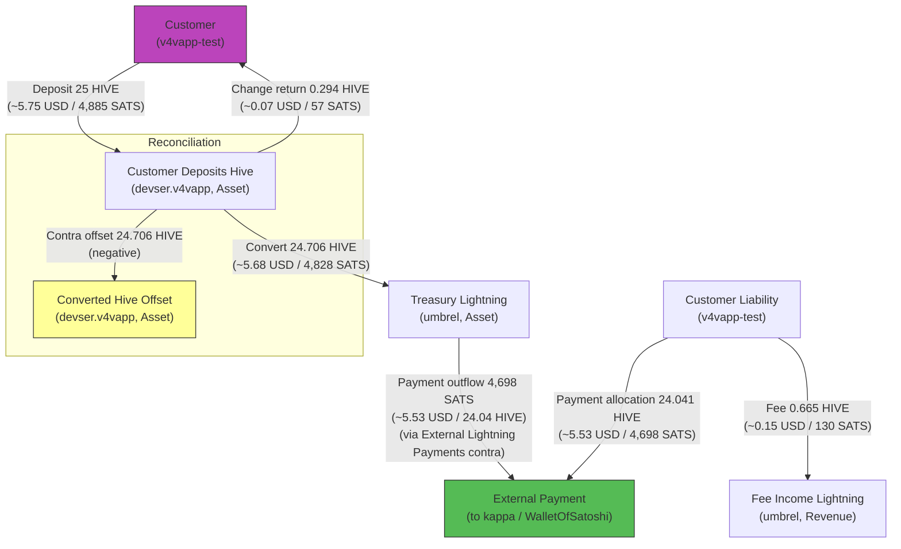
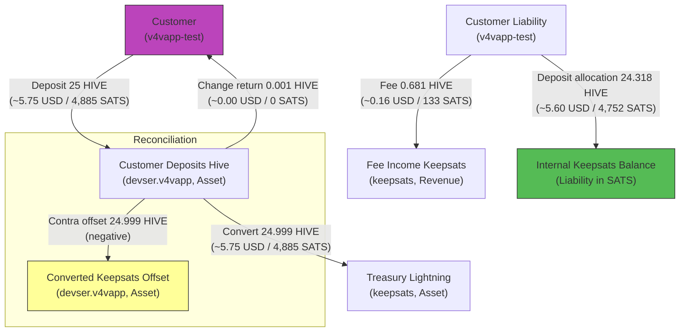
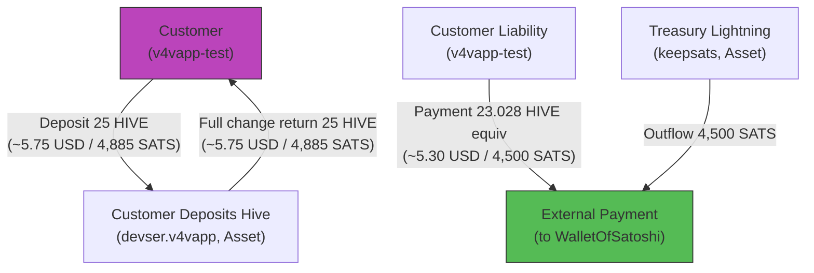

```mermaid
flowchart TD
    A["Customer<br/>(v4vapp-test)"] -->|"Deposit 25 HIVE<br/>(~5.75 USD / 4,885 SATS)"| B["Customer Deposits Hive<br/>(devser.v4vapp, Asset)"]
    B -->|"Convert 24.706 HIVE<br/>(~5.68 USD / 4,828 SATS)"| C["Treasury Lightning<br/>(umbrel, Asset)"]
    C -->|"Payment outflow 4,698 SATS<br/>(~5.53 USD / 24.04 HIVE)<br/>(via External Lightning Payments contra)"| D["External Payment<br/>(to kappa / WalletOfSatoshi)"]
    E["Customer Liability<br/>(v4vapp-test)"] -->|"Fee 0.665 HIVE<br/>(~0.15 USD / 130 SATS)"| F["Fee Income Lightning<br/>(umbrel, Revenue)"]
    E -->|"Payment allocation 24.041 HIVE<br/>(~5.53 USD / 4,698 SATS)"| D
    B -->|"Change return 0.294 HIVE<br/>(~0.07 USD / 57 SATS)"| A

    subgraph Reconciliation
        B -->|"Contra offset 24.706 HIVE<br/>(negative)"| G["Converted Hive Offset<br/>(devser.v4vapp, Asset)"]
    end

    style A fill:#b4b,stroke:#333
    style D fill:#5b5,stroke:#333
    style G fill:#ff9,stroke:#333
```
----------------

```mermaid
flowchart TD
    A["Customer<br/>(v4vapp-test)"] -->|"Deposit 25 HIVE<br/>(~5.75 USD / 4,885 SATS)"| B["Customer Deposits Hive<br/>(devser.v4vapp, Asset)"]
    B -->|"Convert 24.999 HIVE<br/>(~5.75 USD / 4,885 SATS)"| C["Treasury Lightning<br/>(keepsats, Asset)"]
    E["Customer Liability<br/>(v4vapp-test)"] -->|"Fee 0.681 HIVE<br/>(~0.16 USD / 133 SATS)"| F["Fee Income Keepsats<br/>(keepsats, Revenue)"]
    E -->|"Deposit allocation 24.318 HIVE<br/>(~5.60 USD / 4,752 SATS)"| H["Internal Keepsats Balance<br/>(Liability in SATS)"]
    B -->|"Change return 0.001 HIVE<br/>(~0.00 USD / 0 SATS)"| A

    subgraph Reconciliation
        B -->|"Contra offset 24.999 HIVE<br/>(negative)"| G["Converted Keepsats Offset<br/>(devser.v4vapp, Asset)"]
    end

    style A fill:#b4b,stroke:#333
    style H fill:#5b5,stroke:#333
    style G fill:#ff9,stroke:#333
```
----------------

```mermaid
flowchart TD
    A["Customer<br/>(v4vapp-test)"] -->|"Deposit 25 HIVE<br/>(~5.75 USD / 4,885 SATS)"| B["Customer Deposits Hive<br/>(devser.v4vapp, Asset)"]
    B -->|"Full change return 25 HIVE<br/>(~5.75 USD / 4,885 SATS)"| A
    E["Customer Liability<br/>(v4vapp-test)"] -->|"Payment 23.028 HIVE equiv<br/>(~5.30 USD / 4,500 SATS)"| D["External Payment<br/>(to WalletOfSatoshi)"]
    C["Treasury Lightning<br/>(keepsats, Asset)"] -->|"Outflow 4,500 SATS"| D

    style A fill:#b4b,stroke:#333
    style D fill:#5b5,stroke:#333
```